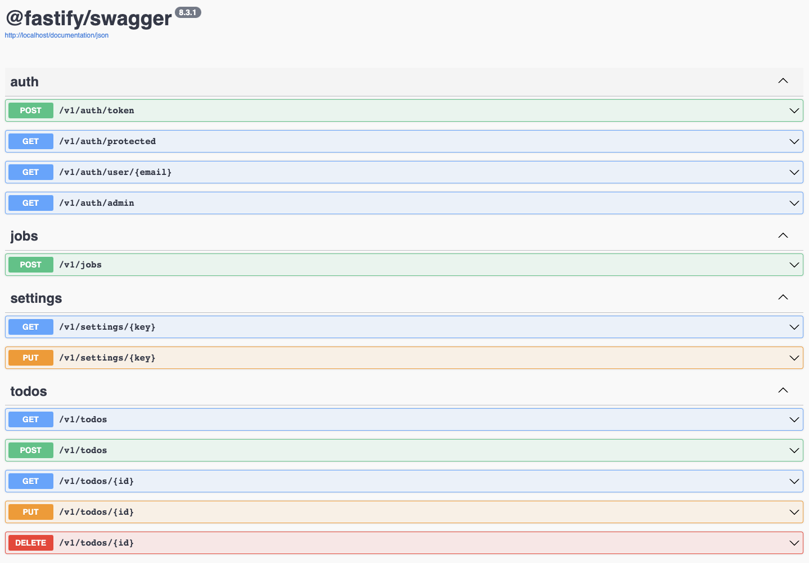

# Fastify API

Showcasing fastify in a modern Node.js project.

### Run the app

- `docker compose up -d`
- Visit [http://localhost/documentation](http://localhost/documentation)

## Technologies

### Environment

- `Node.js`
- `Typescript`
- `SWC`

### Libraries

- `Fastify`
- `Pino`
- `Typebox`
- `Kysely`
- `Paseto`
- `BullMQ`
- `Vitest`
- `ESLint`

### Services

- `Postgres`
- `Redis`

### Putting it all together

- `Docker`
